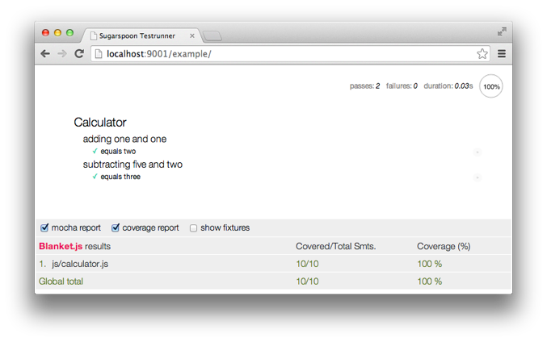
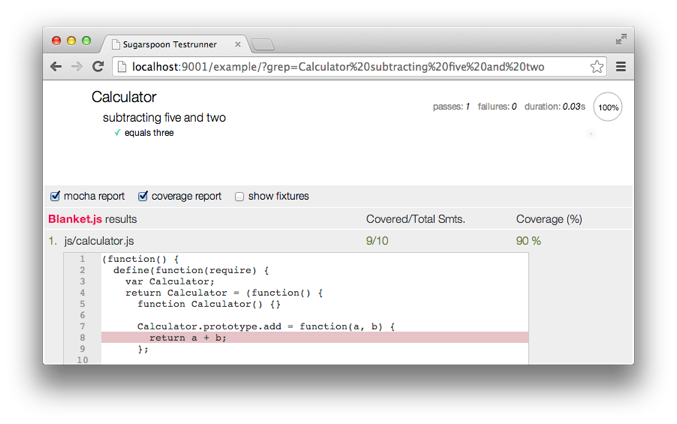

sugarspoon
==========

Sugar-coated testing framework built around [RequireJS][requirejs], [Mocha][mocha], [Chai][chai] and [Blanket.js][blanket]

* [Features](#features)
* [Usage](#usage)
* [Changelog](#changelog)
* [Background & credits](#credits)

Features
--------

* **Easy configuration** of Blanket.js with Mocha and AMD (based on the [mochablanket adapter][mochablanket] provided by Blanket.js)
* **Toggle Blanket.js coverage report** with automatic browser reload
* **Persisted test settings** ("mocha report", "coverage report" and "show fixtures") across reloads (using HTML5 local storage)
* [Base test utility functions][doc_use_utils] for writing clean Mocha tests with less code

Compared to the standard Mocha HTML output, Sugarspoon adds a settings bar at the bottom:

Files names in the coverage report can be clicked to show line-based coverage (this is standard Blanket.js):

Usage
-----

* [Installing Sugarspoon][doc_install] using bower
* See the [example][src_example] directory for a working demonstration
* [Defining your tests][doc_use_definition] using RequireJS
* Some [general notes][doc_general] on Mocha and testing approaches
* [Base test utility functions][doc_use_utils] for namespacing an cleanup in your Mocha tests
* How to get [selective coverage reporting][doc_use_coverage] with Blanket.js
* [Best practices][doc_best_practices] for writing your tests
* Some more [testing techniques][doc_techniques]

Changelog
---------

### 0.3.4-dev

* Fixed error in `ViewTestManager.setClass()` if no "render" method is defined on your class.
* ...

### 0.3.3

* `TestManager` now has an `autoResetSpies` property (defaults to true). If set to false, you can reset the Sinon spies (created through the `@sandbox`) yourself using `@testManager.resetSandboxSpies()`.

### 0.3.2

* Add support for [grunt-blanket-mocha][grunt-blanket-mocha] for getting test coverage output on the command-line.
* The `blanketOptions` passed to the `TestRunner` can now be a function, to allow for the grunt-blanket-mocha reporter option to be set only if running in PhantomJS (see the example directory).
* Refactored the Gruntfile and TestRunner.

### 0.3.1

* Moved many bower dependencies from dev-only dependencies to the normal "dependencies" list, since you will actually need them to use Sugarspoon.
* Extensively updated documentation
* Avoided loading the regular Mocha testrunner when using the Blanket coverage runner 

### 0.3.0

* Added `baseTest()`, `viewTest()`, `modelTest()` and `collectionTest()` utility functions, along with unit tests for their functionality.
* Added a special `meta/sanitycheck` test suite to for checking left-behind properties on the Mocha test context. 

### 0.2.2

* Fix leftbehind `loadNpmTasks` calls in Gruntfile
* Renamed `adapters` and `runners` directories to `adapter` and `runner`

### 0.2.1

* Fix semver tag for bower

### 0.2.0

* Mocha is no longer loaded using RequireJS – it should be loaded through a regular script tag instead. This is for [compatibility with grunt-mocha][grunt-mocha]
* The API of the `TestRunner.run()` has changed; instead of passing the actual modules to run, you should now pass a list of module names to be loaded (using RequireJS). The TestRunner now makes sure to execute the test suites in order. Note that you still have to make sure to return a function from the test module instead of the direct call to `describe()`.
* Removed default Blanket `filter` in the `CoverageRunner`. Configuration options for Blanket can now be passed to the `TestRunner` as a `blanketOptions` object. The `coverage` option on the `TestRunner` has been removed.
* Added [.editorconfig][editorconfig] and [coffeelint][coffeelint] for syntax checking.
* Changed Sugarspoon source code from 4 spaces to 2 spaces.

### 0.1.1

* More flexible jQuery dependency in `bower.json`; any 2.x version should be fine.

### 0.1.0

* First public release; mostly to be considered as proof-of-concept

<!--
TODO:

* [ ] Add support for Jasmine (as alternative to Mocha)
* [ ] Test (and add support if necessary) for non-AMD configuration
-->

Background & credits
--------------------

Sugarspoon started as part of the [Goeie Jongens][gj] HTML5 toolkit and was further developed for [Easytobook.com][etb].

I wanted to unit test my JavaScript code and optionally have coverage reporting. Although Blanket.js has some separate examples of usage with AMD/RequireJS and Mocha, I found it non-trivial to get the combination to work.

Also, since adding Blanket.js introduces quite a bit of overhead (feels about 2x slower with coverage reporting enabled), I wanted a way to quickly enable or disable coverage in the Mocha web UI.

While I was at it, I also added some extra configuration options to show/hide the detailed Mocha output itself, as well as some very simple HTML fixtures management (Backbone view elements).

Finally, recognizing that the shared testing context in Mocha tests can lead to undesired side-effects between tests, several [base test utility functions][doc_use_utils] were added to help namespace data and behavior on the test context and clean them up automatically.

[doc_install]: doc/installation.md
[doc_general]: doc/general.md
[doc_use_coverage]: doc/usage_coverage_reporting.md
[doc_use_definition]: doc/usage_defining_tests.md
[doc_use_utils]: doc/usage_utility_functions.md
[doc_best_practices]: doc/best_practices.md
[doc_techniques]: doc/techniques.md
[src_example]: example/

[blanket]: http://blanketjs.org
[chai]: http://chaijs.com
[coffeelint]: http://www.coffeelint.org
[editorconfig]: http://editorconfig.org
[etb]: https://github.com/easytobook/ "Easytobook.com"
[gj]: http://goeiejongens.nl/ "Goeie Jongens"
[grunt-mocha]: https://github.com/kmiyashiro/grunt-mocha#amd
[mocha]: http://visionmedia.github.io/mocha/
[mochablanket]: https://github.com/alex-seville/blanket/blob/master/src/adapters/mocha-blanket.js
[grunt-blanket-mocha]: https://github.com/ModelN/grunt-blanket-mocha
[requirejs]: http://requirejs.org
